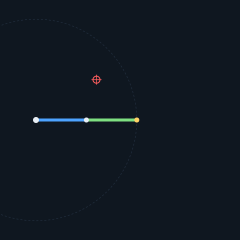

# projet_bras_robotique

Un bras robotique de table qui **suit un objet en mouvement lent, prédit sa trajectoire et
l'intercepte**. Le cœur — cinématique, perception, prédiction, coordination — est écrit en
**C++20**, testé et intégré en continu. C'est du code, pas de la configuration de firmware
tiers : la valeur est dans les algorithmes.



*(Phase 0 : on entre une cible, la lib calcule les angles articulaires par cinématique
inverse, et le bras simulé va s'y poser.)*

## Statut

| Phase | Contenu | État |
|-------|---------|------|
| **0** | Socle logiciel : lib de cinématique FK/IK, CMake, tests, CI, sanitizers, démo |  Fait |
| 1 | Perception : webcam + marqueur ArUco → position 3D | À venir |
| 1.5 | IHM de supervision (Qt) | À venir |
| 2+ | Bras physique, suivi temps réel, anticipation, coordination 2 bras | À venir |

## Ce que fait la Phase 0

Une bibliothèque `kinematics` pour un bras plan, plus une démo qui la donne à voir :

- **Cinématique directe (FK)** — `forward_kinematics(arm, angles)` : à partir des angles
  articulaires, calcule la pose de l'effecteur. Chaque segment est une transformation
  homogène 2D (rotation puis translation le long de l'axe local) ; on **chaîne les
  matrices** depuis la base et on lit la pose finale dans la colonne de translation.

- **Cinématique inverse (IK)** — `inverse_kinematics_2link(l1, l2, x, y, elbow)` : à partir
  d'une cible, calcule les angles qui l'atteignent. Résolution **analytique** :
  - l'angle du coude θ₂ vient de la **loi des cosinus** appliquée au triangle
    (l1, l2, distance base→cible) ; son signe distingue les deux solutions
    (**coude haut / coude bas**) ;
  - l'angle d'épaule θ₁ = `atan2(y, x) − atan2(l2·sin θ₂, l1 + l2·cos θ₂)` ;
  - une cible hors de la **couronne atteignable** `|l1 − l2| ≤ d ≤ l1 + l2` renvoie
    `std::nullopt` — une absence de solution, pas une erreur.

La démo (`app/arm_demo.cpp`) interpole les angles depuis la pose de repos jusqu'à la
solution IK et écrit une animation SVG. Aucune dépendance graphique.

## Architecture

```
include/kinematics/   API publique de la lib (en-têtes)
src/                  implémentation (planar_arm, inverse_kinematics)
tests/                tests unitaires Catch2
app/                  démo (exécutable)
```

La lib est une **logique pure, sans I/O ni matériel** : elle se teste entièrement hors
cible. Les tests d'IK ne figent aucun angle — ils vérifient la **propriété** attendue
(`forward_kinematics(inverse_kinematics(cible)) == cible`), la bonne façon de tester une
fonction à solutions multiples.

## Construire, tester, lancer

Prérequis : compilateur C++20 (GCC ≥ 12), CMake ≥ 3.20, Ninja, et
[vcpkg](https://github.com/microsoft/vcpkg) avec `VCPKG_ROOT` positionné. Les dépendances
(Eigen, Catch2) sont déclarées dans `vcpkg.json` et installées à la configuration.

```bash
cmake --preset vcpkg          # configure + installe les dépendances
cmake --build --preset vcpkg  # compile la lib, les tests et la démo
ctest --preset vcpkg          # 11 tests

./build/arm_demo 1.2 0.8 arm_demo.svg   # génère l'animation ; ouvre le SVG dans un navigateur
```

## Discipline d'ingénierie

`-Wall -Wextra -Wpedantic -Werror`, AddressSanitizer / UBSan disponibles
(`-DENABLE_SANITIZERS=ON`), CI GitHub Actions à chaque push, lib testée séparément de
l'I/O. Même rigueur que le projet précédent (protocole UDP + télémétrie).
